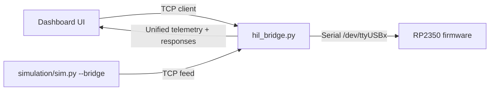

# План интеграции HIL без WiFi

## Цель

Сделать единый транспорт для `dashboard`, чтобы он работал одинаково с реальным контроллером (`RP2350` по UART) и с симуляцией (`sim.py`), без WiFi-модуля.

## Архитектура

## Шаги реализации

- Добавить bridge-инструмент [tools/hil_bridge.py](/home/danila/Documents/roborace/umbreon_zephyr/tools/hil_bridge.py) с режимами:
  - `real`: проксирование dashboard↔UART (`$`-команды и телеметрия строками).
  - `sim`: проксирование dashboard↔sim TCP endpoint.
  - `dual`: dashboard получает `real` и `sim` (с префиксом источника) для сравнения.
- Добавить CLI-скрипты запуска [tools/run_hil_real.sh](/home/danila/Documents/roborace/umbreon_zephyr/tools/run_hil_real.sh), [tools/run_hil_sim.sh](/home/danila/Documents/roborace/umbreon_zephyr/tools/run_hil_sim.sh), [tools/run_hil_dual.sh](/home/danila/Documents/roborace/umbreon_zephyr/tools/run_hil_dual.sh).
- Добавить зависимости для bridge (например `pyserial`) в [requirements-hil.txt](/home/danila/Documents/roborace/umbreon_zephyr/requirements-hil.txt).
- Обновить [Makefile](/home/danila/Documents/roborace/umbreon_zephyr/Makefile): цели `hil-real`, `hil-sim`, `hil-dual`, `hil-deps`.
- Обновить документацию в [README.md](/home/danila/Documents/roborace/umbreon_zephyr/README.md):
  - wiring (RP2350↔USB-TTL, ST-Link отдельно),
  - матрица режимов (`real/sim/dual`),
  - команды запуска и ожидаемые порты.

## Технические решения

- Использовать строковый pass-through протокола (без изменения firmware).
- Для `dual` не ломать существующий dashboard: по умолчанию отдавать `real`, а `sim` дублировать в отдельный TCP порт/канал для сравнения.
- Таймауты и reconnect в bridge: автоподключение к UART/sim при обрыве.

## Проверка

- Smoke `real`: bridge открывает UART, `$PING`→`$PONG`, `$STATUS` отвечает.
- Smoke `sim`: bridge подключается к `sim.py --bridge`, dashboard получает CSV телеметрию.
- Smoke `dual`: одновременно видны потоки `real` и `sim`, нет блокировок UI.
- Проверка команд `START/STOP/GET/SET` в `real` и `sim` режимах через один и тот же dashboard endpoint.

